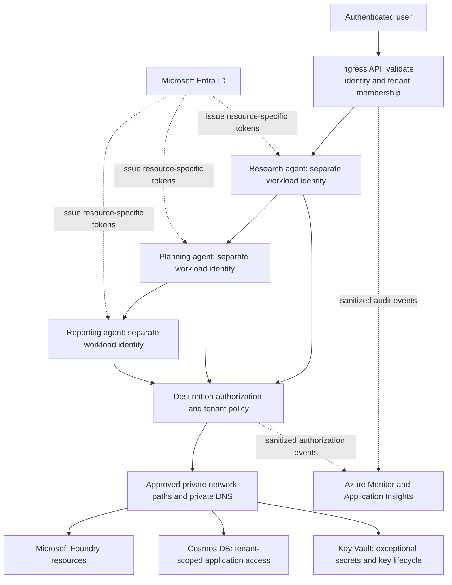

# Secure Multi-Agent Systems with Azure Zero-Trust Architecture

An Azure security architecture portfolio project using **Microsoft Foundry**, **Microsoft Entra ID**, **Azure Container Apps**, and **Azure Cosmos DB**, demonstrating per-agent identity, least-privilege authorization, private networking, tenant isolation, and security observability.

## Project Overview

This is **Project #11** in Victor Scott's Microsoft Foundry and Azure AI engineering portfolio. It extends the orchestration foundation in [Project #09](https://github.com/VicScottNYC/09-microsoft-agent-framework-multi-agent-system) and the operations foundation in [Project #10](https://github.com/VicScottNYC/10-genaiops-foundry-infrastructure) with a security design for enterprise multi-agent workloads.

**Status:** Microsoft Learn Module 11 and extension reading were reported complete by the learner on October 5, 2026. This repository consolidates that learning into portfolio documentation. The architecture below is a proposed design; no deployment, role assignments, tenant-boundary test results, or compliance certification are claimed. No Module 11 application source or cloud exports were found in the inspected local module folders. See [completion and provenance](docs/completion-and-provenance.md).

## Training Context and Attribution

Microsoft's [Secure multi-agent systems with Azure zero-trust architecture](https://learn.microsoft.com/en-us/training/modules/aaai-secure-multi-agent-systems-azure-zero-trust/) is the original learning material. Microsoft owns its training content. This repository contains portfolio synthesis and design decisions derived from the learning topics, rather than a copy of Microsoft Learn or a Microsoft-authored deployment sample. Documentation was prepared with assistant support from the learner's confirmed learning scope. Official reference links are in [sources](docs/sources.md).

## Zero Trust Architecture



The diagram expresses trust boundaries, not a deployed Azure topology. Agent communication uses destination-specific authentication and authorization even on internal network paths. Tenant context is checked at ingress and every downstream service. Full design: [architecture](docs/architecture.md).

## Zero Trust Principles

| Principle | Portfolio design decision |
|---|---|
| Verify explicitly | Validate token issuer, audience, signature, expiry, caller permissions, and tenant membership before access. Recheck authorization at each agent/tool boundary. |
| Use least privilege | Separate agent workloads and identities; scope data access to required resources and actions; use time-limited privileged human administration. |
| Assume breach | Limit lateral movement, validate untrusted agent output, restrict egress, isolate higher-risk tenants, and prepare detection and containment. |

Private networking is one control in this design. Identity and application authorization remain necessary on every route.

## Completed Extension Topics

| Extension | Learning status | Portfolio artifact |
|---|---|---|
| 1. Microsoft Zero Trust security model | Reading complete, learner reported | Principles and trust boundaries |
| 2. Azure Managed Identities + RBAC | Reading complete, learner reported | Identity matrix and authentication flows |
| 3. Azure Container Apps networking/security | Reading complete, learner reported | Ingress, egress, private endpoint and segmentation design |
| 4. Azure Cosmos DB security/tenant isolation | Reading complete, learner reported | Tenant propagation, encryption and data-boundary design |
| 5. Capstone documentation | Consolidated in this repository | Architecture, risks, validation plan, lessons and provenance |

Kubernetes/NetworkPolicy was explicitly excluded from the selected extension scope. This project does not require an AKS deployment.

## Identity and RBAC

Use a distinct managed identity for each independently hosted agent. A shared process or compute resource that can obtain every agent identity weakens isolation; agent names alone do not establish separate security principals. Grant only the destination service's required data-plane permissions. Azure control-plane Contributor access does not substitute for Cosmos DB data-plane authorization.

| Workload | Intended access | Explicit restriction |
|---|---|---|
| Research | Read approved knowledge resources | No dataset writes or role management |
| Planning | Read approved inputs and write planning records | No unrelated containers or privileged administration |
| Reporting | Read approved results and write reports | No source-data mutation or credential management |
| Platform administrator | Controlled configuration changes | JIT human elevation, approval and audit |

For Cosmos DB for NoSQL, scope native data-plane roles to database/container resources where possible. Shared-container tenant partitions still require server-side tenant authorization. Avoid treating a partition key as an RBAC scope. See [identity and data controls](docs/security-controls.md).

## Networking and Secure Communication

Use a suitable Container Apps environment with VNet integration, intentional internal/external ingress, private DNS, approved private endpoints, and restricted outbound paths. Environment and plan capabilities determine supported routing, private endpoint and firewall features. Apps in one environment share a network; VNet integration and subnet NSGs do not automatically create per-agent isolation. Consider separate environments for stronger trust boundaries.

Authenticate service calls over TLS. If client certificates are used, validate certificate identity and trust explicitly; forwarding a certificate alone is not authorization. Restrict tool destinations and reject model-generated arbitrary URLs. See [architecture](docs/architecture.md).

## Tenant Isolation and Encryption

Derive application tenant context from authenticated membership, not from a prompt or client-provided tenant header alone. Enforce it on reads, writes, point reads, queries, caches, vector retrieval, queues, and reports. Shared Cosmos DB containers use tenant partition keys for data organization, with application authorization preventing cross-tenant access. Separate accounts or containers may be required for stronger isolation.

Use TLS for data in transit and Cosmos DB's encryption at rest. Consider customer-managed keys only when requirements justify their lifecycle and availability costs. Store exceptional secrets and certificates in Key Vault with restricted access, rotation and audit; managed identities reduce application-managed credentials.

## Monitoring and Auditing

Correlate agent/tool calls with request IDs and approved tenant identifiers. Record authorization decisions, denied requests, privileged changes and abnormal egress without logging tokens, keys, raw prompts or sensitive tenant documents. Combine application telemetry with service diagnostic settings, Azure Activity Log and managed-identity sign-in evidence. Set retention, access policies, alert ownership and an incident-response procedure. A log stream alone does not prove compliance.

## Security Risks and Mitigations

| Risk | Mitigation |
|---|---|
| Compromised agent or prompt injection | Constrain tool permissions; validate output; require human approval for high-impact operations |
| Shared identity and lateral movement | Separate hosting/identity boundaries; scope roles; validate every downstream call |
| Cross-tenant data disclosure | Trusted tenant context; mandatory tenant-aware access layer; negative tests; stronger isolation where required |
| Data exfiltration | Approved egress, destination allowlists, private resource paths and alerts |
| Secret or certificate exposure | Managed identity first; Key Vault for exceptions; rotation and redacted telemetry |
| Audit gaps or misleading compliance claims | Collect evidence, assign control owners, and validate against actual requirements |

Detailed [threat model and validation plan](docs/threat-model-and-validation.md) records proposed checks, not completed test results.

## Lessons Learned

- Agent specialization and security isolation are separate design problems.
- Credential-free authentication still needs explicit authorization and permission review.
- Tenant partitioning improves data organization but does not enforce tenant access rights by itself.
- Private connectivity must be paired with identity, tenant checks and controlled egress.
- Encryption protects stored and transmitted data; authorized misuse still requires prevention and monitoring.
- Security and compliance claims need evidence from the deployed system.

## Project Structure

```text
11-azure-zero-trust-multi-agent-security/
├── .gitignore
├── README.md
└── docs/
    ├── architecture.md
    ├── security-controls.md
    ├── threat-model-and-validation.md
    ├── completion-and-provenance.md
    └── sources.md
```

## Security Considerations

Publication excludes environment files, credentials, API keys, access tokens, subscription identifiers, connection strings, private keys, virtual environments, generated caches, machine paths and raw session data. All published files are reviewed text. No deployment commands run from this repository. The absence of runtime code reflects the materials located, and avoids presenting invented implementation as completed work.

## Engineering Skills Demonstrated

Security architecture analysis; Zero Trust control mapping; workload identity design; data-plane permission scoping; private-network planning; multitenant authorization; encryption/key lifecycle considerations; threat modeling; audit design; evidence-based portfolio documentation.

## Future Implementation and Evidence

Implement and validate the proposed controls before describing this as deployed: sanitized infrastructure, separated agent workloads, verified assignments, tenant-boundary tests, egress tests, redacted audit samples and response exercises. Preserve any future source attribution and licenses alongside copied Microsoft samples.

## License

Intended for educational and portfolio demonstration purposes. Microsoft Learn content remains subject to Microsoft's applicable terms; linked material is not relicensed here.
